# Measure of central tendency
------------------------------

### Mode Moda

value that ocurrs most frecuently
most common outcome
nominal or ordinal measure

```R
    > moda(x)  // funcion realizada
```

### Median Mediana

The middle value of your observation
when arranged from smallest to largest
50% below the median, 50 above the median

```R
    > median(x)
```


### Mean Promedio

The sum of all the values divided by the 
number of observations

```R
    > mean(x)
```

## Distribution or dispertion
------------------------------

### Range

highest value - lowest value

```R
    > max(x) - min(x)
```

### Quartile

```R
    > quantile(x)
    > Q1 <- quantile(x)[2]
    > Q3 <- quantile(x)[4]
```

* 25%  Q1
* 50%  Q2
* 75%  Q3
* 100% Q4

### Interquartile range

Diferencia entre Q3 y Q1

```R
    > Q3 - Q1
```
## IQR

```R
 > IQR <- Q3 - Q1

> IQR(vector)
```


### Outliers: 

```R
    > #Lower:  
    > Q1 - 1.5*IQR(x)
    > #higher: 
    > Q3 + 1.5*IQR
```

### Box Plot

```R
    > boxplot(vector)
```

### Dot Plot
```R
> dotplot(vector)
```

### Variance

The variance tells you how far the scores
are spread out from the mean.

### standard deviation


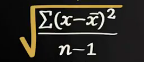

```R
> sd(vector)
```

### Z-Score
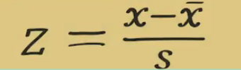
```R
> scale(x, center=TRUE, scale=TRUE)
```

## R
----

### ver estructura del objeto
```R
> str(x)
```
### ver dimensiones
```R
> dim(x)
```

### hacer una tabla de frecuencias (con un vector de factores)
```R
> table(mtcars$am)
```
### También se hace una tabla de contingencia cuando son dos variables:

Crea una tabla con row = tobacco column = student : 
```R
 > table(smoking$tobacco, smoking$student)
```

### hacer un grafico de barras con la tabla de frecuencias
```R
> barplot(table, ylab = "label y", xlab = "label x")
```
### hacer un histograma
```R
> hist(vector, main="titulo")
```

## Correlation and Regression
-----------------------------
### Correlation between two variables.


#### Contengency table
Used for nominal and ordinal variables. 

#### Scatterplot
Used for quantitative variables.
### Pearson's R
Measure of correlation.
Expresses the direction and strength of the linear
correlation between two variables with a single number.

Pearson's R is allways a number between -1 and 1.

Only for linear relation.

Formula:  

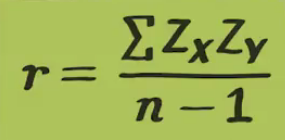

Where:

* **Zx** Z Score of x variable.
* **Zy** Z Score of y variable.
* **x** Numbers of elements.

```R
    > cor(var1, var2, method="pearson")
# Pearson is the default method...
```


### Regression Line

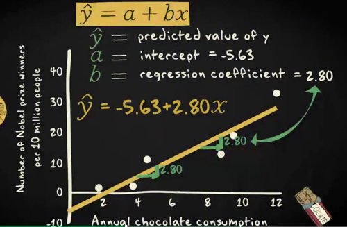

### Compute regression line

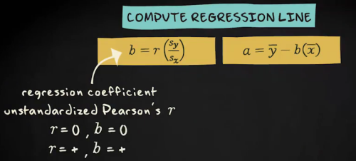

### **r2** (squared 2) or correlation coefficient (wikipedia).

Tells yoy how much better a regression line predicts the value
of a dependent variable than the mean of the variable.

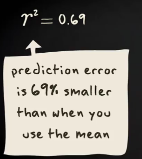

```R
        > money
         [1]  1  2  3  4  5  6  7  8  9 10
        > prosocial
         [1]  3  2  1  4  5 10  8  7  6  9
        > plot(money, prosocial)
        > abline(lm(prosocial ~ money))
        > abline(mean(prosocial),0)
        > lm(prosocial~money)

        Call:
        lm(formula = prosocial ~ money)

        Coefficients:
        (Intercept)        money  
             1.2000       0.7818  
```
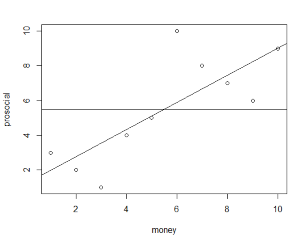


### Explained variance

**model assumptions**:
The centre of the Y distribution must be a linear function of X,
and for any given x, the Y distribution must be normal.
In this case, R2 is interpreted as proportion of explained variance.


The left circle represents the variance of independent variable
X and the right circle stands for the variance of dependent
variable Y.The overlap represents **r-squared or the explained variance**

# Probability distributions
---------------------------


## Random variable.  
  A random variable assigns a single numerical value to each basic 
  outcome in the sample space.

###  Discrete   
     Probability mass function

  Probability distributions

P(x)

## Cumulative probability

F(X) = P(x<=x)

Example:  
```R
 //The sum of rolling two dice:    
    P(x=2)  = 1/36
    P(x=3)  = 2/36
    P(x=4)  = 3/36
    P(x=5)  = 4/36
    P(x=6)  = 5/36
    P(x=7)  = 6/36
    P(x=8)  = 5/36
    P(x=9)  = 4/36
    P(x=10) = 3/36
    P(x=11) = 2/36
    P(x=12) = 1/36
```
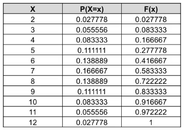
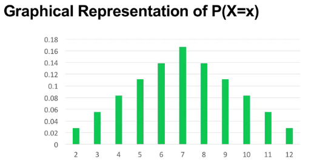


### Expected value  
    Mean (or Expected value) of a discrete random variable X
    is the probability-weighted sum of all possible values.

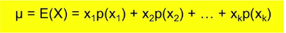

Example: rolling a single fair dice:

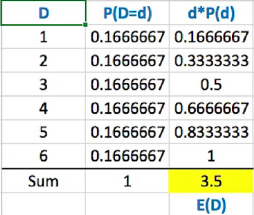

### Measures of dispersion

*   Variance
    The variance of a discrete random variable is the 
    probability-weigthed sum of all posible squared deviations
    from the mean.

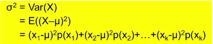

* Standard deviation

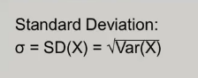
    


  


  
*  Continous  
     Probability density functions

